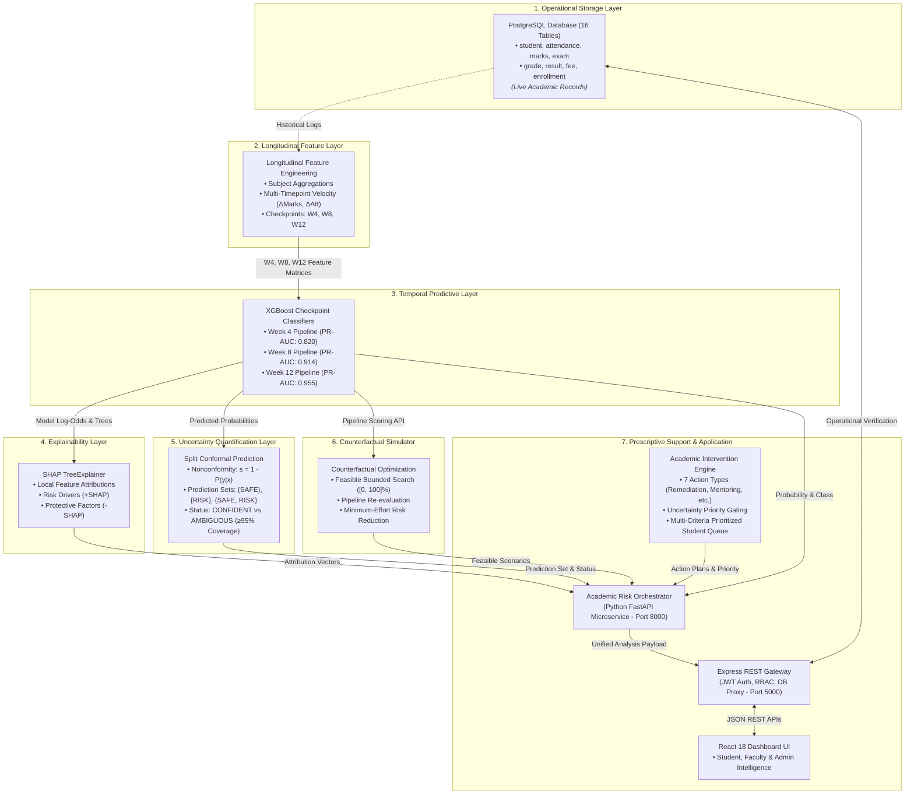

# EduInsight AI — Architecture Diagram Specification

This document provides exact instructions, node labels, inputs, outputs, technologies, and data-flow arrows for rendering the official system architecture diagram.

---

## 1. Mermaid Architecture Diagram

---

## 2. Block-by-Block Specification Table

| Block ID | Box Name | Input | Output | Technology Used |
|---|---|---|---|---|
| **1** | PostgreSQL Operational DB | Daily university transactions | Relational student tables | PostgreSQL 14+ Relational DBMS |
| **2** | Longitudinal Feature Layer | Historical attendance & internal marks | $W_4, W_8, W_{12}$ Feature CSVs | Python, `pandas`, `scipy` |
| **3** | Temporal Predictive Layer | In-semester feature vectors | Continuous risk probability $P(\text{Risk})$ | Python 3.13, `xgboost`, `scikit-learn` |
| **4** | SHAP Explainability Layer | Model tree ensembles & feature rows | Ranked additive Shapley attributions | `shap` (v0.52.0), `TreeExplainer` |
| **5** | Conformal Uncertainty Layer | Calibration nonconformity scores | Finite-sample prediction sets & status | Split Conformal Classification |
| **6** | Counterfactual Simulator | At-risk feature vector & bounds | Minimum-change feasible modification | Real-Pipeline Optimization Algorithm |
| **7** | Prescriptive Intervention Engine | Multi-signal evidence vector | Prioritized action plans & student queue | Rule-based Multi-Signal Engine |
| **8** | Central Orchestration Service | Student ID, Semester, Checkpoint | Unified 360° decision-support JSON | FastAPI, Uvicorn, Pydantic |
| **9** | Express Gateway & REST API | Authenticated client requests | Verified REST JSON responses | Node.js, Express, `pg`, JWT |
| **10** | Frontend Dashboard UI | User interaction & queries | Interactive Intelligence Centers | React 18, Tailwind CSS, Recharts |
