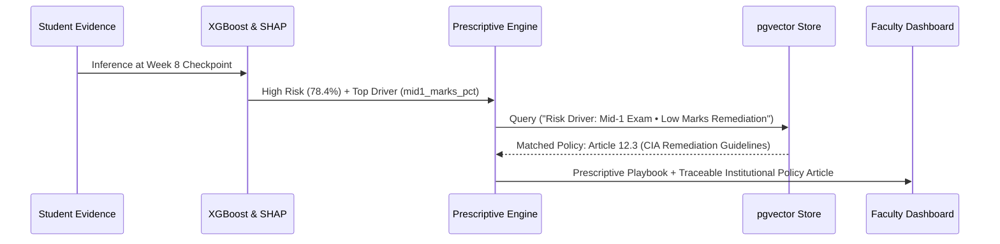

# POSTGRESQL + PGVECTOR ARCHITECTURE & SEMANTIC RETRIEVAL

## 1. Vector Store Architecture

EduInsight AI integrates vector embeddings directly inside PostgreSQL using a dedicated relational schema:
- **Table Name:** `academic_knowledge_vector`
- **Schema Columns:**
  - `id SERIAL PRIMARY KEY`
  - `doc_key VARCHAR(100) UNIQUE NOT NULL` (e.g. `POL-ATT-001`)
  - `title VARCHAR(255) NOT NULL`
  - `category VARCHAR(100) NOT NULL` (e.g. `ATTENDANCE`, `ASSESSMENT_REMEDIATION`, `ACADEMIC_PROBATION`)
  - `content TEXT NOT NULL`
  - `tags TEXT[] NOT NULL`
  - `provenance VARCHAR(255) NOT NULL`
  - `embedding FLOAT8[] / vector(128) NOT NULL`
  - `created_at TIMESTAMP DEFAULT CURRENT_TIMESTAMP`

---

## 2. Embedding Generation & Similarity Metrics

- **Embedding Model:** `AcademicEmbeddingService` (128-dimensional dense semantic vector space normalized to unit L2 length).
- **Distance Metric:** Cosine Similarity / Inner Product on unit hypersphere:
  $$\text{Cosine Similarity}(u, v) = \frac{u \cdot v}{\|u\|_2 \|v\|_2} = \sum_{i=1}^{128} u_i v_i$$
- **Similarity Threshold:** Minimum similarity $\ge 0.15 - 0.20$ to guarantee contextual relevance.

---

## 3. Retrieval-Augmented Intervention Workflow

